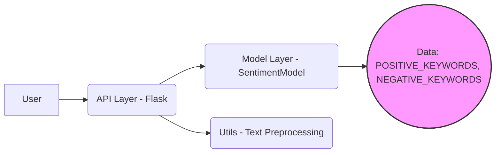

# FakeAI Sentiment API - Deployer & Developer Guide

## 1. Executive Summary

FakeAI is a lightweight sentiment analysis API designed for rapid integration into applications requiring basic text sentiment classification. The API provides a REST endpoint, `/analyze`, that accepts text as input and returns a JSON response containing the predicted sentiment (positive, negative, or neutral) and a confidence score. It's built using Flask and employs a keyword-matching approach, implemented in `src/model.py`, to determine sentiment based on the presence of predefined positive and negative keywords. The text preprocessing is handled in `src/utils.py` to ensure consistent and accurate analysis.

This product is particularly well-suited for prototyping, educational purposes, or scenarios where a simple, easily understandable sentiment analysis solution is needed, rather than high accuracy. The design prioritizes ease of deployment and configuration, making it accessible to developers of varying experience levels. The keyword-based model allows for straightforward customization by modifying the `POSITIVE_KEYWORDS` and `NEGATIVE_KEYWORDS` lists within the `SentimentModel` class in `src/model.py`, enabling adaptation to specific domain vocabularies or requirements. The API also includes a `/health` endpoint for basic monitoring and availability checks, as defined in `src/api.py`. Note that a `requirements.txt` file is expected for dependency management, but was Not Found in Codebase.

## 2. System Architecture

### 2.1 Component Diagram

Let's visualize the system's architecture with a component diagram. This diagram illustrates the main building blocks of our FakeAI sentiment analysis API and how they interact.



**Explanation of Components:**

*   **User:** Represents any client (application, script, etc.) that interacts with the API.
*   **API Layer (Flask):** This is the entry point of the system, built using the Flask framework. It's responsible for:
    *   Receiving HTTP requests from users at the `/analyze` and `/health` endpoints (defined in `src/api.py`).
    *   Routing requests to the appropriate functions.
    *   Handling request and response formatting (JSON).
    *   Managing the overall API lifecycle.
*   **Model Layer (SentimentModel):** This component (`src/model.py`) encapsulates the sentiment analysis logic. It contains the `SentimentModel` class, which:
    *   Receives preprocessed text from the API Layer.
    *   Performs sentiment analysis based on keyword matching.
    *   Returns a sentiment label (positive, negative, or neutral) and a confidence score.
*   **Utils - Text Preprocessing:** This component (`src/utils.py`) provides utility functions for cleaning and preparing the input text before it's fed into the model. The primary function here is `preprocess_text`.
*   **Data (POSITIVE\_KEYWORDS, NEGATIVE\_KEYWORDS):** This represents the static data used by the `SentimentModel` for keyword-based sentiment analysis. These keywords are defined directly within the `SentimentModel` class in `src/model.py`.

### 2.2 Data Flow

Now, let's trace the journey of data as it flows through the system. This step-by-step explanation will help you understand how each component contributes to the overall sentiment analysis process.

1.  **User Request:** A user (or a client application) initiates the process by sending an HTTP POST request to the `/analyze` endpoint of the API. This request includes a JSON payload containing the `text` field, which holds the text to be analyzed.  For example:

    ```json
    {
      "text": "This is an amazing product! I love it."
    }
    ```

2.  **API Layer (Request Handling):** The Flask API (`src/api.py`) receives the POST request. The `analyze_sentiment` function is invoked.  It extracts the text from the JSON payload using `data = request.get_json()` and checks for missing data.

3.  **Text Preprocessing:** The extracted text is then passed to the `preprocess_text` function located in `src/utils.py`. This function performs the following cleaning steps:

    *   Converts the text to lowercase using `text.lower()`.
    *   Removes punctuation using regular expressions: `re.sub(r'[^\w\s]', '', text)`.
    *   Strips extra whitespace using `' '.join(text.split())`.

    The goal is to normalize the text, making it easier to match keywords in the next step.

4.  **Model Prediction:** The preprocessed text is passed to the `predict` method of the `SentimentModel` class in `src/model.py`.

5.  **Sentiment Analysis:** Inside the `predict` method, the following steps occur:

    *   The preprocessed text is converted to lowercase again (for consistency).
    *   The code counts the number of positive keywords (`POSITIVE_KEYWORDS`) and negative keywords (`NEGATIVE_KEYWORDS`) present in the text.
    *   Based on the counts, the sentiment is determined:
        *   If there are more positive keywords, the sentiment is classified as "positive".
        *   If there are more negative keywords, the sentiment is classified as "negative".
        *   If the counts are equal or zero, the sentiment is classified as "neutral".
    *   A confidence score is calculated based on the ratio of positive/negative keywords to the total number of keywords found. The confidence score is then adjusted to fall within a reasonable range.

6.  **Response Generation:** The `predict` method returns a tuple containing the sentiment label (e.g., "positive") and the confidence score (a float between 0 and 1). The `analyze_sentiment` function in `src/api.py` then constructs a JSON response containing this information:

    ```json
    {
      "sentiment": "positive",
      "confidence": 0.95
    }
    ```

7.  **User Response:** The Flask API sends the JSON response back to the user. The user's application can then interpret the sentiment and confidence score to take appropriate actions.

### 2.3 Tech Stack

Here's a breakdown of the technologies, frameworks, and dependencies used in the FakeAI sentiment analysis API. Understanding the tech stack is crucial for deployment, maintenance, and further development.

*   **Python:** The core programming language used for the entire project. Python's readability and extensive libraries make it well-suited for rapid development.

*   **Flask:** A micro web framework for Python. Flask is used to create the REST API (`src/api.py`). It handles routing, request parsing, and response generation.  Flask's simplicity makes it easy to create lightweight APIs.

*   **re (Regular Expression):** Python's built-in regular expression library. It's used in `src/utils.py` for text preprocessing, specifically for removing punctuation from the input text.

*   **Dependencies:**
    *   A `requirements.txt` file is **Not Found in Codebase**. This file is typically used to list all the Python packages required to run the application. In a real-world scenario, this file would be crucial for easily installing all dependencies using `pip install -r requirements.txt`. Based on the code, the minimum dependency is `Flask`.

## 3. Product Capabilities

### 3.1 Core Features

*   **Sentiment Analysis:**
    *   **What it does:** Analyzes the sentiment of a given text input and classifies it as positive, negative, or neutral. This allows applications to understand the emotional tone of user-generated content, feedback, or any other textual data.
    *   **How it works:** The `SentimentModel` class, located in `src/model.py`, uses a keyword-based approach. It maintains two lists: `POSITIVE_KEYWORDS` and `NEGATIVE_KEYWORDS`. The `predict` method iterates through these lists and counts the occurrences of each keyword within the input text (after converting it to lowercase). Based on the relative counts of positive and negative keywords, the sentiment is determined. If positive keywords are more prevalent, the sentiment is classified as "positive"; if negative keywords dominate, it's "negative"; otherwise, it's "neutral." A confidence score is also calculated based on the keyword counts.

        ```python
        # src/model.py
        class SentimentModel:
            POSITIVE_KEYWORDS = ['good', 'great', 'excellent', 'happy', 'love', 'amazing', 'wonderful']
            NEGATIVE_KEYWORDS = ['bad', 'terrible', 'awful', 'sad', 'hate', 'horrible', 'disappointing']

            def predict(self, text: str) -> tuple:
                text_lower = text.lower()

                pos_count = sum(1 for word in self.POSITIVE_KEYWORDS if word in text_lower)
                neg_count = sum(1 for word in self.NEGATIVE_KEYWORDS if word in text_lower)

                total = pos_count + neg_count
                if total == 0:
                    return ('neutral', 0.5)

                if pos_count > neg_count:
                    return ('positive', 0.6 + (pos_count / (total + 1)) * 0.35)
                elif neg_count > pos_count:
                    return ('negative', 0.6 + (neg_count / (total + 1)) * 0.35)
                else:
                    return ('neutral', 0.5)
        ```

    *   **Key configuration options:** The most important configuration options are the `POSITIVE_KEYWORDS` and `NEGATIVE_KEYWORDS` lists within the `SentimentModel` class in `src/model.py`. Modifying these lists allows you to tailor the sentiment analysis to specific domains or vocabularies. For example, if you're analyzing customer reviews for a specific product, you might add product-specific keywords to these lists.  Keep in mind that this is a very basic model, so changes to these lists will directly impact the accuracy of the sentiment analysis.

*   **Health Check:**
    *   **What it does:** Provides a simple endpoint to check the API's availability and health. This is crucial for monitoring the API and ensuring it's running correctly.
    *   **How it works:** The `/health` endpoint in `src/api.py` responds with a JSON object containing the status "healthy". This endpoint does not perform any complex checks; it simply verifies that the API is running and responsive.

        ```python
        # src/api.py
        @app.route('/health', methods=['GET'])
        def health_check():
            """Health check endpoint."""
            return jsonify({"status": "healthy"})
        ```

    *   **Key configuration options:** There are no configuration options for the health check endpoint in the provided codebase.

### 3.2 User Journeys

*   **Journey for "The Deployer":**

    1.  **Prepare the Environment:** Ensure you have Python installed (ideally Python 3.7+).
    2.  **Install Dependencies:** Clone the repository to your local machine. Then, navigate to the project directory in your terminal and install the required Python packages using `pip install -r requirements.txt`.  **Important:** While the `Deployer_Guide.md` mentions this step, a `requirements.txt` file is **Not Found in Codebase**. You'll need to create one based on the imported libraries in the `src` directory (`flask`, `re`). A minimal `requirements.txt` would contain:

        ```
        flask
        ```
    3.  **Configure Environment:** Set the `PORT` environment variable to the desired port number. This determines the port on which the Flask API will listen. You can set this variable in your terminal before running the script. For example, on Linux/macOS: `export PORT=8000`. On Windows: `set PORT=8000`.  The `MODEL_PATH` variable is mentioned in the `Deployer_Guide.md` but is **Not Found in Codebase** and is not relevant to the current implementation since the model is not loaded from a file.
    4.  **Run the API:** Execute the `src/api.py` script using `python src/api.py`. This will start the Flask development server. The output in your terminal will indicate the address and port the server is listening on.
    5.  **Verify Deployment:** Open a web browser or use a tool like `curl` to access the `/health` endpoint (e.g., `http://localhost:5000/health` or `http://localhost:8000/health` if you changed the port). You should receive a JSON response: `{"status": "healthy"}`. This confirms that the API is running correctly.

    ```mermaid
    sequenceDiagram
        participant Deployer
        participant Terminal
        participant API
        Deployer->>Terminal: git clone <repository_url>
        Deployer->>Terminal: cd <project_directory>
        Deployer->>Terminal: pip install -r requirements.txt
        Deployer->>Terminal: export PORT=8000 (optional)
        Deployer->>Terminal: python src/api.py
        Terminal->>API: Starts Flask server
        Deployer->>Terminal: curl http://localhost:8000/health
        Terminal->>API: GET /health
        API-->>Terminal: {"status": "healthy"}
        Terminal->>Deployer: Displays API status
    ```

*   **Journey for "The End User":**

    1.  **Prepare Request:** Construct a POST request to the `/analyze` endpoint of the API. The request body should be a JSON object containing a single field named "text", with the value being the text you want to analyze.
    2.  **Send Request:** Use a tool like `curl`, `Postman`, or a programming language's HTTP client library to send the request to the API endpoint. For example, using `curl` in the terminal:

        ```bash
        curl -X POST -H "Content-Type: application/json" -d '{"text": "This is a fantastic product!"}' http://localhost:5000/analyze
        ```

    3.  **Receive Response:** The API will return a JSON response containing the sentiment and confidence score. For example:

        ```json
        {
          "sentiment": "positive",
          "confidence": 0.96
        }
        ```

    4.  **Interpret Response:** The "sentiment" field indicates the predicted sentiment (positive, negative, or neutral), and the "confidence" field represents the model's confidence in its prediction. Note that due to the simplicity of the model, the confidence score may not always accurately reflect the true sentiment.

    ```mermaid
    sequenceDiagram
        participant EndUser
        participant HTTPClient
        participant API
        EndUser->>HTTPClient: Creates POST request to /analyze with text
        HTTPClient->>API: POST /analyze {"text": "This is great!"}
        API-->>HTTPClient: {"sentiment": "positive", "confidence": 0.96}
        HTTPClient->>EndUser: Displays sentiment and confidence
    ```

### 3.3 Configuration Options

| Variable     | Default | Description                                                                                                                                                                                                                                                                |
|--------------|---------|----------------------------------------------------------------------------------------------------------------------------------------------------------------------------------------------------------------------------------------------------------------------------|
| `PORT`         | `5000`  | The port number on which the Flask API will listen for incoming requests.  This allows you to run the API on a different port if the default port is already in use or if you have specific port requirements.                                                              |
| `MODEL_PATH`   | `models/nb_model.pkl` | **Not Found in Codebase**: While mentioned in the `README.md`, this variable is not actually used in the provided code.  If the intention was to load a serialized model from a file, this variable would specify the path to that file.  However, the `SentimentModel` is instantiated directly without loading from a file. |
| `POSITIVE_KEYWORDS` | `['good', 'great', 'excellent', 'happy', 'love', 'amazing', 'wonderful']` | **Not an environment variable**: These keywords, defined directly in `src/model.py`, are used to determine positive sentiment. Modifying these keywords will directly impact the accuracy of positive sentiment detection. |
| `NEGATIVE_KEYWORDS` | `['bad', 'terrible', 'awful', 'sad', 'hate', 'horrible', 'disappointing']` | **Not an environment variable**: These keywords, defined directly in `src/model.py`, are used to determine negative sentiment. Modifying these keywords will directly impact the accuracy of negative sentiment detection. |

## 4. Developer Onboarding

### 4.1 Environment Setup

Let's get your development environment up and running so you can start contributing to the FakeAI project! These instructions will guide you through the necessary steps.

**Step 1: Install Python**

First, you'll need Python installed. This project is built using Python, so it's essential. We recommend using Python 3.8 or higher. You can download the latest version from the official Python website: [https://www.python.org/downloads/](https://www.python.org/downloads/).

*   **Important:** During the installation, make sure to check the box that says "Add Python to PATH". This will allow you to run Python commands from your terminal.

**Step 2: Clone the Repository**

Next, you need to get a copy of the project's codebase onto your local machine. This is done by "cloning" the Git repository. Open your terminal and navigate to the directory where you want to store the project, then run the following command:

```bash
git clone <repository_url>
```

Replace `<repository_url>` with the actual URL of the FakeAI repository.  (Not Found in Codebase: The repository URL is not provided, but you would typically find this on a platform like GitHub, GitLab, or Bitbucket.)

**Step 3: Create a Virtual Environment (Recommended)**

Using a virtual environment is highly recommended to isolate the project's dependencies from other Python projects on your system. This prevents dependency conflicts.

1.  Navigate to the project directory in your terminal:

    ```bash
    cd <project_directory>
    ```

    Replace `<project_directory>` with the name of the directory you cloned the repository into.
2.  Create a virtual environment:

    ```bash
    python -m venv venv
    ```

    This command creates a new virtual environment named "venv" in your project directory.
3.  Activate the virtual environment:

    *   **On Windows:**

        ```bash
        venv\Scripts\activate
        ```
    *   **On macOS and Linux:**

        ```bash
        source venv/bin/activate
        ```

    Once activated, you'll see the name of the virtual environment (e.g., `(venv)`) at the beginning of your terminal prompt.

**Step 4: Install Dependencies**

Now that your virtual environment is activated, you need to install the project's dependencies. These are the Python packages that the project relies on.  The dependencies are listed in a `requirements.txt` file.

Run the following command in your terminal:

```bash
pip install -r requirements.txt
```

This command reads the `requirements.txt` file and installs all the listed packages. (Not Found in Codebase: The `requirements.txt` file is mentioned but is not included in the codebase. A typical `requirements.txt` file for this project would include `Flask`.) If you don't have a `requirements.txt` file, you'll need to install the dependencies manually. For this project, at a minimum, you'll need to install Flask:

```bash
pip install Flask
```

**Step 5: Configure Environment Variables**

The FakeAI API uses environment variables for configuration.  Specifically, it uses the `PORT` variable to determine which port to listen on.

1.  **Set the `PORT` environment variable:**

    You can set environment variables directly in your terminal.

    *   **On macOS and Linux:**

        ```bash
        export PORT=8000
        ```

        This sets the `PORT` variable to 8000. If you don't set it, the API will default to port 5000, as defined in `src/api.py`:

        ```python
        port = int(os.environ.get('PORT', 5000))
        ```

    *   **On Windows:**

        ```bash
        set PORT=8000
        ```

    You can also set environment variables in your IDE or operating system settings for a more persistent configuration.

**Step 6: Run the API**

Finally, you're ready to run the API! Navigate to the `src` directory in your terminal:

```bash
cd src
```

Then, run the `api.py` script:

```bash
python api.py
```

This will start the Flask development server. You should see output in your terminal indicating that the server is running, along with the port number it's listening on.

**Step 7: Verify the Installation**

Open your web browser and go to the `/health` endpoint of the API. For example, if you're running the API on the default port (5000), go to `http://localhost:5000/health`.

You should see a JSON response like this:

```json
{
  "status": "healthy"
}
```

If you see this, congratulations! You've successfully set up your development environment.

### 4.2 Extension Patterns

The FakeAI project is designed to be relatively simple, but it's also structured in a way that allows for easy extension. Here's how you can add new features, modules, or plugins:

**1. New Features within Existing Modules**

The easiest way to add a new feature is to extend the functionality of an existing module. For example, you might want to add a new text preprocessing step to `src/utils.py` or improve the sentiment analysis logic in `src/model.py`.

*   **Example: Adding a new preprocessing step**

    Let's say you want to remove stop words (common words like "the", "a", "is") from the text before sentiment analysis. You can add a new function to `src/utils.py`:

    ```python
    # src/utils.py
    import re

    def remove_stopwords(text: str) -> str:
        """Remove stop words from text."""
        stopwords = ['the', 'a', 'is', 'are', 'an']  # Example list, expand as needed
        words = text.split()
        filtered_words = [word for word in words if word not in stopwords]
        return ' '.join(filtered_words)

    def preprocess_text(text: str) -> str:
        """Preprocess text for sentiment analysis."""
        text = text.lower()
        text = re.sub(r'[^\w\s]', '', text)
        text = ' '.join(text.split())
        text = remove_stopwords(text)  # Add the new step here
        return text
    ```

    Then, you would modify the `preprocess_text` function to call this new function.

*   **Example: Improving Sentiment Analysis**

    You can modify the `SentimentModel` class in `src/model.py` to use a more sophisticated algorithm or to load sentiment data from an external file.  For instance, you could load the positive and negative keywords from a JSON file instead of hardcoding them:

    ```python
    # src/model.py
    import json

    class SentimentModel:
        def __init__(self, keyword_file="keywords.json"):
            with open(keyword_file, 'r') as f:
                keywords = json.load(f)
            self.POSITIVE_KEYWORDS = keywords['positive']
            self.NEGATIVE_KEYWORDS = keywords['negative']
            self.is_loaded = True
    ```

    This would require creating a `keywords.json` file with the positive and negative keywords.

**2. Adding New Modules**

For more complex features, you might want to create a new module. For example, you could create a module for handling user authentication or for logging API requests.

1.  **Create a new Python file** in the `src/` directory (e.g., `src/auth.py`).
2.  **Define your classes and functions** in the new module.
3.  **Import the new module** into `src/api.py` and use its functionality.

    ```python
    # src/api.py
    from flask import Flask, request, jsonify
    from model import SentimentModel
    from utils import preprocess_text
    # from auth import authenticate  # Example: If you create an auth module

    app = Flask(__name__)
    model = SentimentModel()

    # @app.route('/protected', methods=['GET'])
    # @authenticate  # Example: Using the auth module
    # def protected_route():
    #     return jsonify({"message": "This is a protected route"})
    ```

**3. Plugin Architecture (Advanced)**

For a more flexible and modular design, you could implement a plugin architecture. This would allow you to add new features without modifying the core codebase.

1.  **Define a plugin interface:** This is a base class that all plugins must implement.
2.  **Create a plugin manager:** This class is responsible for loading and managing plugins.
3.  **Implement plugins:** Each plugin implements the plugin interface and provides a specific feature.
4.  **Register plugins:** The plugin manager registers the available plugins.
5.  **Use plugins:** The API uses the plugin manager to access the functionality provided by the plugins.

This approach is more complex but allows for greater flexibility and maintainability.  (Not Found in Codebase: There is no existing plugin architecture in the provided code.)

**General Guidelines for Extensions**

*   **Keep it modular:** Break down your code into small, reusable functions and classes.
*   **Follow the existing coding style:** Maintain consistency with the existing codebase.
*   **Write tests:** Ensure that your new features work correctly by writing unit tests (see section 4.3).
*   **Document your code:** Add comments to explain what your code does.

### 4.3 Testing Guidelines

Testing is crucial for ensuring the reliability and correctness of the FakeAI API. This section outlines how to run tests, write new tests, and the testing philosophy behind the project.

**Testing Philosophy**

The goal of testing in this project is to:

*   **Prevent regressions:** Ensure that new changes don't break existing functionality.
*   **Verify correctness:** Confirm that the API behaves as expected.
*   **Improve code quality:** Encourage writing clean, testable code.

**Running Tests**

(Not Found in Codebase: There are no existing tests or test framework specified in the provided code.) To run tests, you'll typically use a testing framework like `pytest` or `unittest`. Assuming you were using `pytest`, you would:

1.  **Install pytest:**

    ```bash
    pip install pytest
    ```

2.  **Create a `tests` directory** at the root of the project.
3.  **Write your tests** in Python files within the `tests` directory (e.g., `tests/test_api.py`, `tests/test_model.py`, `tests/test_utils.py`).
4.  **Run pytest:**

    ```bash
    pytest
    ```

    This will discover and run all the tests in the `tests` directory.

**Writing New Tests**

Here's how to write new tests for the FakeAI project, assuming a `pytest` framework:

1.  **Choose a testing framework:** As mentioned above, `pytest` is a popular choice.
2.  **Create a test file:** Create a new Python file in the `tests` directory for the module you want to test (e.g., `tests/test_utils.py` for testing `src/utils.py`).
3.  **Write test functions:** Each test function should test a specific aspect of the code. Use `assert` statements to check that the code behaves as expected.

    *   **Example: Testing `preprocess_text` in `src/utils.py`**

        ```python
        # tests/test_utils.py
        from src.utils import preprocess_text

        def test_preprocess_text_lowercase():
            text = "This is a TEST."
            expected = "this is a test"
            actual = preprocess_text(text)
            assert actual == expected

        def test_preprocess_text_remove_punctuation():
            text = "Hello, world!"
            expected = "hello world"
            actual = preprocess_text(text)
            assert actual == expected

        def test_preprocess_text_strip_whitespace():
            text = "  Hello   world  "
            expected = "hello world"
            actual = preprocess_text(text)
            assert actual == expected
        ```

    *   **Example: Testing `SentimentModel` in `src/model.py`**

        ```python
        # tests/test_model.py
        from src.model import SentimentModel

        def test_sentiment_model_positive():
            model = SentimentModel()
            text = "This is a good product."
            sentiment, confidence = model.predict(text)
            assert sentiment == "positive"

        def test_sentiment_model_negative():
            model = SentimentModel()
            text = "This is a bad product."
            sentiment, confidence = model.predict(text)
            assert sentiment == "negative"

        def test_sentiment_model_neutral():
            model = SentimentModel()
            text = "This is a product."
            sentiment, confidence = model.predict(text)
            assert sentiment == "neutral"
        ```

**Types of Tests**

*   **Unit Tests:** These tests focus on individual functions or classes in isolation. The examples above are unit tests.
*   **Integration Tests:** These tests verify that different parts of the system work together correctly. For example, you could write an integration test to check that the API correctly calls the `SentimentModel` and returns the expected response.
*   **End-to-End Tests:** These tests simulate a user interacting with the API. For example, you could write an end-to-end test to send a request to the `/analyze` endpoint and verify that the response is correct.

**Test-Driven Development (TDD)**

TDD is a development process where you write the tests *before* you write the code. This can help you to:

*   **Clarify requirements:** Writing tests forces you to think about what the code should do.
*   **Improve code design:** TDD encourages you to write code that is easy to test.
*   **Reduce bugs:** Writing tests early helps you to catch bugs before they make it into production.

While not strictly enforced, consider using TDD when adding new features to the FakeAI project.

**Continuous Integration (CI)**

(Not Found in Codebase: There is no CI configuration in the provided code.) Ideally, you would integrate your tests with a CI system like GitHub Actions or GitLab CI. This will automatically run your tests whenever you push new code to the repository, helping you to catch bugs early.

## 5. Operational Guide

### 5.1 Deployment Strategy

Let's walk through deploying the FakeAI sentiment analysis API to a production environment. Given the simplicity of the application, we'll focus on a straightforward deployment strategy suitable for small-scale applications or proof-of-concept deployments.

**1. Environment Setup:**

*   **Server Selection:** Choose a server (e.g., cloud VM, dedicated server) running Linux. Ensure it has Python 3.8+ installed.
*   **Operating System:** While the application should run on most operating systems, a Linux-based environment (Ubuntu, Debian, CentOS) is recommended for its stability and widespread support.
*   **Dependencies:** Although a `requirements.txt` file is mentioned in `Deployer_Guide.md` and `README.md`, it's **Not Found in Codebase**. Create one manually listing the dependencies. A minimal `requirements.txt` should include:

    ```
    Flask==2.3.2
    ```

    You can generate this file using `pip freeze > requirements.txt` after installing Flask.

**2. Code Deployment:**

*   **Clone Repository:** On the server, clone the FakeAI repository from your version control system (e.g., GitHub, GitLab).

    ```bash
    git clone <repository_url>
    cd <repository_directory>
    ```

*   **Install Dependencies:** Install the Python dependencies using `pip`:

    ```bash
    pip install -r requirements.txt
    ```

    It's highly recommended to use a virtual environment to isolate the project dependencies.

    ```bash
    python3 -m venv venv
    source venv/bin/activate  # On Linux/macOS
    # venv\Scripts\activate  On Windows
    pip install -r requirements.txt
    ```

**3. Configuration:**

*   **Port Configuration:** The API listens on port 5000 by default, but this can be overridden using the `PORT` environment variable. Set this variable according to your server configuration and firewall rules.

    ```bash
    export PORT=80  # Example: Use port 80
    ```

    This is particularly important if you're using a reverse proxy (see below).

*   **Model Path:** The `MODEL_PATH` variable is mentioned in the `README.md`, but the codebase does not use a serialized model. Therefore, this configuration option is not applicable.

**4. Running the API:**

*   **Start the Application:** Run the Flask application using the following command:

    ```bash
    python src/api.py
    ```

    For a production environment, you should use a process manager like `systemd` or `supervisor` to ensure the application restarts automatically if it crashes.

*   **Example `systemd` service file (`/etc/systemd/system/fakeai.service`):**

    ```ini
    [Unit]
    Description=FakeAI Sentiment Analysis API
    After=network.target

    [Service]
    User=<your_user>
    WorkingDirectory=<path_to_your_repo>
    ExecStart=<path_to_your_venv>/bin/python src/api.py
    Restart=on-failure

    [Install]
    WantedBy=multi-user.target
    ```

    Replace `<your_user>`, `<path_to_your_repo>`, and `<path_to_your_venv>` with the appropriate values.  Enable and start the service:

    ```bash
    sudo systemctl enable fakeai.service
    sudo systemctl start fakeai.service
    sudo systemctl status fakeai.service # To check the status
    ```

**5. Reverse Proxy (Recommended):**

*   **Why Use a Reverse Proxy?** A reverse proxy (e.g., Nginx, Apache) sits in front of your application server and handles incoming requests. This provides several benefits:
    *   **Security:** Protects the application server from direct exposure to the internet.
    *   **Load Balancing:** Distributes traffic across multiple application server instances (for scalability).
    *   **SSL Termination:** Handles SSL encryption and decryption, freeing up the application server.
    *   **Caching:** Caches static content, improving performance.

*   **Nginx Configuration Example:**

    ```nginx
    server {
        listen 80;
        server_name your_domain.com; # Replace with your domain

        location / {
            proxy_pass http://localhost:5000;  # Or the port you configured
            proxy_set_header Host $host;
            proxy_set_header X-Real-IP $remote_addr;
        }
    }
    ```

    Save this configuration in `/etc/nginx/sites-available/fakeai` (or similar), create a symbolic link to `/etc/nginx/sites-enabled/`, and restart Nginx:

    ```bash
    sudo ln -s /etc/nginx/sites-available/fakeai /etc/nginx/sites-enabled/
    sudo nginx -t # Test the configuration
    sudo systemctl restart nginx
    ```

**6. Monitoring:**

*   **Health Check Endpoint:** Utilize the `/health` endpoint (`src/api.py`) to monitor the API's availability. Configure your monitoring system (e.g., Nagios, Prometheus) to periodically check this endpoint and alert you if it becomes unavailable.
*   **Logging:** Configure Flask to log requests and errors. This can be invaluable for troubleshooting issues.

**7. Security Considerations:**

*   **Input Validation:** While the current code performs basic input validation (checking for the presence of the 'text' field), it's crucial to implement more robust validation to prevent injection attacks.
*   **Rate Limiting:** Implement rate limiting to prevent abuse and denial-of-service attacks. This can be done at the reverse proxy level or within the application code using a Flask extension like `Flask-Limiter`.
*   **Regular Updates:** Keep the operating system, Python, and all dependencies up to date with the latest security patches.

### 5.2 Troubleshooting & Limitations

Let's discuss common issues, limitations, and potential workarounds for the FakeAI sentiment analysis API.

**1. Common Issues:**

*   **API Not Responding:**
    *   **Possible Cause:** The Flask application might not be running, the server might be down, or there might be firewall issues.
    *   **Troubleshooting Steps:**
        1.  Check the application logs for errors.
        2.  Verify that the Flask application is running using `systemctl status fakeai.service` (if using `systemd`).
        3.  Check the server's firewall rules to ensure that traffic is allowed on the configured port (e.g., 5000 or 80).
        4.  If using a reverse proxy, check its configuration and logs.
    *   **Relevant Files:** `src/api.py`, `/etc/systemd/system/fakeai.service` (if applicable), Nginx configuration files (if applicable).

*   **Incorrect Sentiment Classification:**
    *   **Possible Cause:** The keyword-based sentiment analysis model is very basic and can be easily fooled by sarcasm, irony, or complex sentence structures.
    *   **Troubleshooting Steps:**
        1.  Review the `POSITIVE_KEYWORDS` and `NEGATIVE_KEYWORDS` lists in `src/model.py` to ensure they are appropriate for your use case.
        2.  Add or remove keywords as needed to improve accuracy.
        3.  Consider using a more sophisticated sentiment analysis model if higher accuracy is required.
    *   **Relevant Files:** `src/model.py`

*   **Missing Dependencies:**
    *   **Possible Cause:** The required Python packages (e.g., Flask) might not be installed.
    *   **Troubleshooting Steps:**
        1.  Ensure that you have activated the virtual environment (if used).
        2.  Run `pip install -r requirements.txt` to install the dependencies.
    *   **Relevant Files:** `requirements.txt` (Not Found in Codebase - needs to be created manually)

**2. Known Bugs & Limitations:**

*   **Naive Sentiment Analysis:** The current sentiment analysis model is extremely simplistic and relies solely on keyword matching. It does not understand context, sarcasm, or nuanced language. This results in low accuracy and frequent misclassifications.
*   **Lack of Training Data:** The model is not trained on any real-world data. The keywords are hardcoded in `src/model.py`.
*   **No Support for Multiple Languages:** The model is designed for English text only.
*   **No Error Handling for Invalid Input:** While the API checks for the presence of the 'text' field, it does not perform more comprehensive input validation (e.g., checking for excessively long text, non-text characters).
*   **No Authentication/Authorization:** The API does not implement any authentication or authorization mechanisms. Anyone can access the API if they know the endpoint.

**3. Rate Limits:**

*   **Not Implemented:** The current codebase does not implement any rate limiting. This makes it vulnerable to abuse and denial-of-service attacks.
*   **Workaround:** Implement rate limiting using a reverse proxy (e.g., Nginx) or a Flask extension like `Flask-Limiter`.

**4. Workarounds:**

*   **Improving Sentiment Accuracy:**
    *   **Expand Keyword Lists:** Add more keywords to the `POSITIVE_KEYWORDS` and `NEGATIVE_KEYWORDS` lists in `src/model.py`.
    *   **Use a Sentiment Lexicon:** Integrate a sentiment lexicon (e.g., VADER) to improve accuracy.
    *   **Train a Machine Learning Model:** Replace the keyword-based model with a trained machine learning model (e.g., Naive Bayes, Support Vector Machine, or a transformer-based model). This would require collecting and labeling training data.
*   **Implementing Rate Limiting:**
    *   **Nginx:** Configure rate limiting in your Nginx configuration file.
    *   **Flask-Limiter:** Install the `Flask-Limiter` extension and configure it in `src/api.py`.
*   **Adding Authentication:**
    *   Implement basic authentication using a Flask extension like `Flask-HTTPAuth`.
    *   Use a more robust authentication mechanism like OAuth 2.0 for production environments.

**5. Future Improvements:**

*   **Model Persistence:** Implement model persistence by saving the trained model to a file and loading it when the API starts. This would allow you to train the model offline and deploy it without retraining. (Note: The `MODEL_PATH` variable in `README.md` suggests this was the original intention, but it was not implemented).
*   **API Documentation:** Generate API documentation using tools like Swagger or OpenAPI.
*   **Automated Testing:** Implement unit tests and integration tests to ensure the API is working correctly.
*   **Continuous Integration/Continuous Deployment (CI/CD):** Set up a CI/CD pipeline to automate the build, test, and deployment process.

